# Laporan Praktikum Queue

## Jawaban Soal

### Jawaban 8.2.3
- 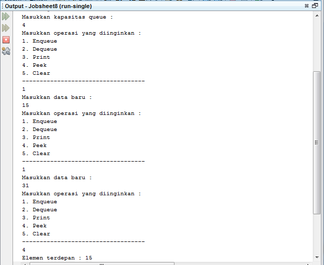

1.	Pada method Create, mengapa atribut front dan rear diinisialisasi dengan nilai -1, tidak 0?

- Jawab:
Karena atribut front dan rear pada queue masih kosong sehingga inisiasinya bernilai -1, apabila front dan rear dinisiasikan bernilai 0 maka dianggap sudah memiliki data sebanyak 1 dalam queue.
2.	Pada method Enqueue, jelaskan maksud dan kegunaan dari potongan kode berikut!

- 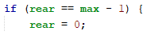 

- Jawab:
Kegunaan dari potongan kode tersebut adalah menunjukkan bahwa queue belum penuh sehingga kondisi tersebut untuk mengecek apakah terletak pada indeks akhir atau tidak jika rear berada di indeks terakhir maka posisi rear selanjutnya berada pada indeks ke 0 pada saat data baru dimasukkan kedalam queue.
3.	Perhatikan kembali method Enqueue, baris kode program manakah yang menunjukkan bahwa data baru disimpan pada posisi terakhir di dalam queue?

- Jawab:
 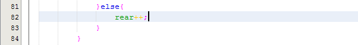
4.	Perhatikan kembali method Dequeue, baris kode program manakah yang menunjukkan bahwa data yang dikeluarkan adalah data pada posisi paling depan di dalam queue?

- Jawab:
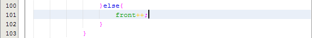 
5.	Pada method Dequeue, jelaskan maksud dan kegunaan dari potongan kode berikut!
- 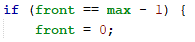
- Jawab:
Ketika front dari queue berada dindeks terakhir array maka pengambilan data akan dilakukan pada indeks terakhir sehingga front akan bergeser ke indeks ke 0.
6.	Pada method print, mengapa pada proses perulangan variabel i tidak dimulai dari 0 (int i=0), melainkan int i=front?

- Jawab:
Karena untuk menampilkan antrian yang akan ditampilkan menggunakan loop pada data yang sudah ditambahkan dan masih berada didalam queue yang belum terambil, sehingga i = front. Apabila i = 0 maka akan ada data yang kosong pada saat dilakukan penampilan menggunakan loop karena loop tidak bisa mengetahui data mana yang sudah terambil atau data yang masih kosong.
7.	Perhatikan kembali method print, jelaskan maksud dari potongan kode berikut!

- Jawab:
Maksud dari potongan program tersebut adalah perulangan akan berhenti jika nilai indeks sama dengan potongan kode tersebut.

### Jawaban 8.3.3
 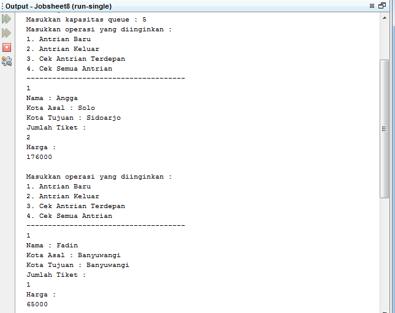
 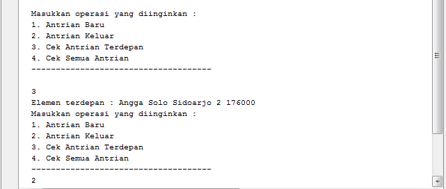
 
1.	Perhatikan class Queue, apa fungsi kode program berikut pada method Dequeue?
- 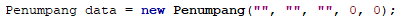

- Jawab:
Fungsi dari kode program tersebut adalah untuk melakukan pemanggilan konstruktor berparameter yang ada pada method Dequeue
2.	Pada soal nomor 1, apabila kode program tersebut diganti dengan kode berikut:
Penumpang data = new Penumpang()
Apakah yang terjadi? Mengapa demikian?

- Jawab:
Program akan error, karena Penumpang merupakan konstruktor berparameter sehingga harus dipanggil dengan konstruktor berparameter juga.
3.	Tunjukkan kode program yang digunakan untuk menampilkan data yang dikeluarkan dari queue!

- Jawab:
 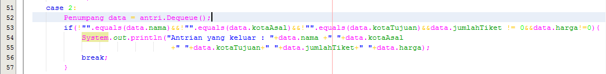

4.	Lakukan modifikasi program dengan menambahkan method baru bernama peekRear pada class Queue yang digunakan untuk mengecek antrian yang berada di posisi belakang! Tambahkan pula daftar menu

- Jawab:
 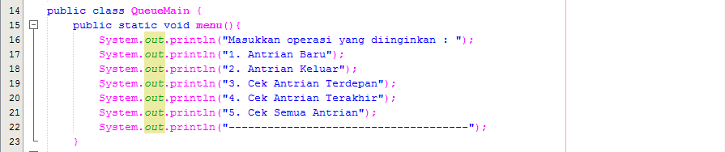
 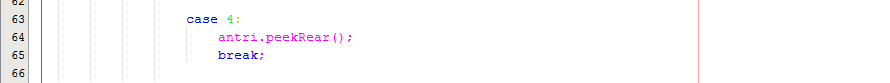
 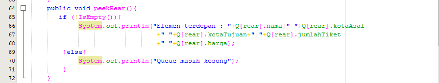

5.	 Cek Antrian paling belakang pada class QueueMain sehingga method peekRear dapat dipanggil!
 
- Jawab:
 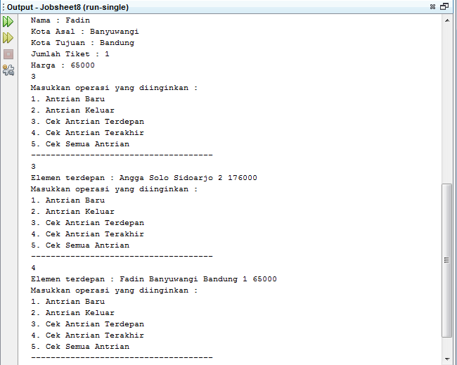

 # OUTPUT PROGRAM
 1. 
  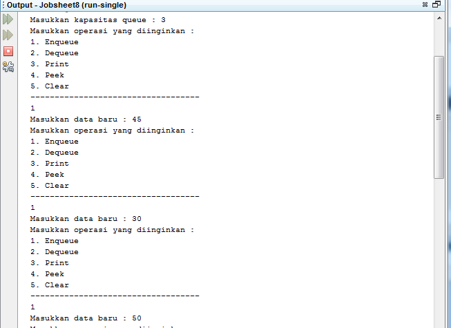
  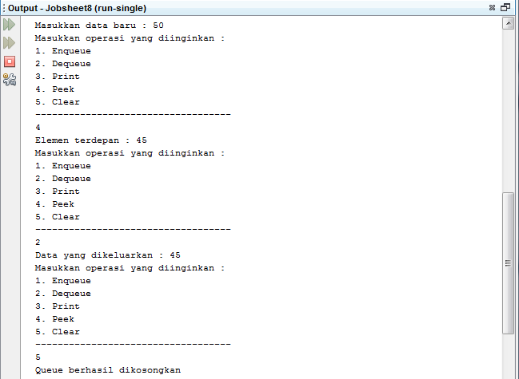

2. 
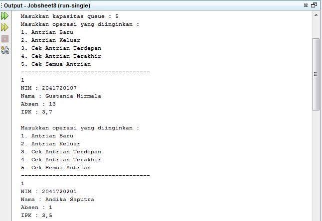
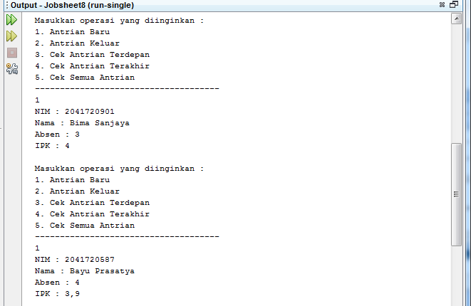
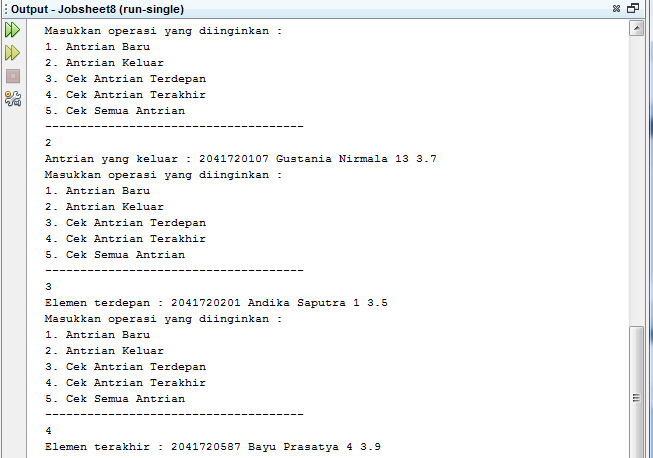
