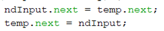
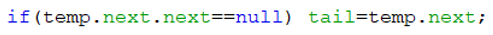
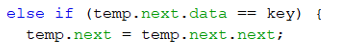
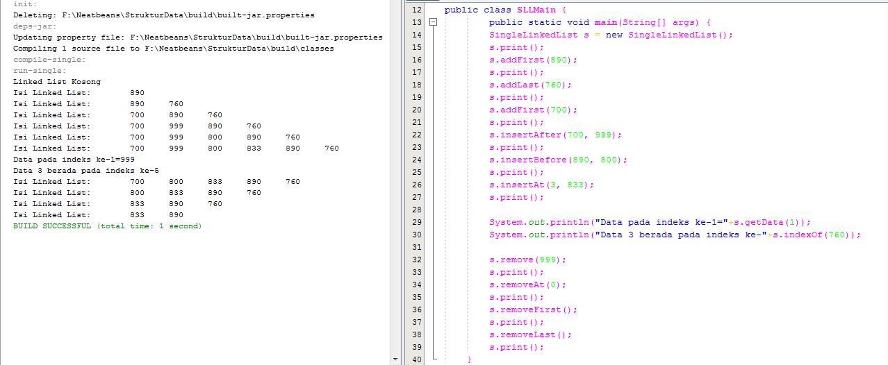
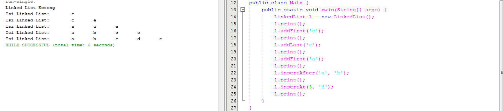
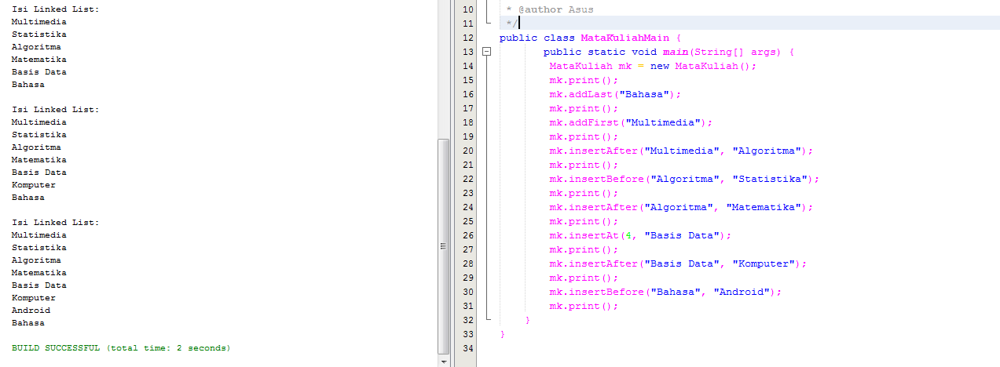
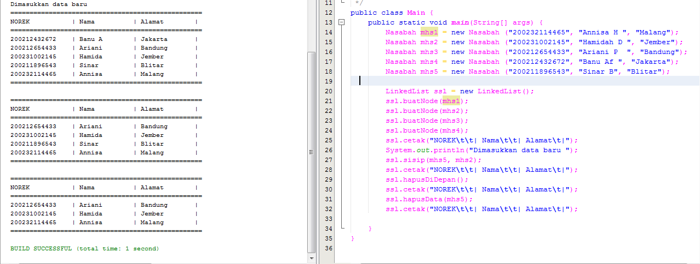

# Laporan Praktikum Linked List
## Jawaban Soal
### Jawaban Pertanyaan 9.2.3
1.	Mengapa hasil compile kode program di baris pertama menghasilkan “Linked List Kosong”?
- Jawab:
Karena belum ada penambahan data pada linked list sehingga muncul output seperti itu
2.	Pada step 10, jelaskan kegunaan kode berikut
 
- Jawab:
Kegunaan dari potongan kode tersebut adalah untuk menunjukkan bahwa nilai yang dinputkan akan berada setelah node key yang tersimpan dalam temp.next
3.	Perhatikan class SingleLinkedList, pada method insertAt  Jelaskan kegunaan kode berikut
 
- Jawab:
Kegunaan kode tersebut adalah untuk mengecek apakah nilai yang dinputkan pada temp.next berada di bagian paling belakang atau tidak, jika iya maka temp.next.next akan bernilai kosong sehingga tail akan berada di temp.next

### Jawaban Pertanyaan 9.3.3
1.	Mengapa digunakan keyword break pada fungsi remove? Jelaskan!
- Jawab:
Fungsi keyword break adalah untuk menghentikan proses ketika kondisi atau data yang node yang ingin dihapus sudah ditemukan
2.	Jelaskan kegunaan kode dibawah pada method remove
 
- Jawab:
Kegunaan kode tersebut apabila kondisi data pada temp.next.data adalah sama dengan data yang ingin dihapus maka nilai temp.next yang menyimpan data key berarti akan dihapus sehingga data pada temp.next akan bergeser ke sampingnya atau temp.next.next
3.	Apa saja nilai kembalian yang dapat dikembalikan pada method indexOf? Jelaskan maksud
masing-masing kembalian tersebut!
- Jawab:
Return -1; maksudnya adalah apabila pada linked list tidak ada data atau kosong maka posisi yang akan menunjukkan pada -1 karena tidak ada data yang ditemukan didalam linked list tersebut. Sedangkan return index; maksudnya adalah ketika linked list berisi data maka akan menunjukkan pada index keberapa data yang dicari ditemukan

## Output
1.  Buat method insertBefore untuk menambahkan node sebelum keyword yang diinginkan

2. Implementasikan ilustrasi Linked List Berikut. Gunakan 4 macam penambahan data yang telah
dipelajari sebelumnya untuk menginputkan data.

3. Buatlah Implementasi Stack berikut menggunakan Linked List

4. Buatlah implementasi program Nasabah Bank menggunakan LinkedList dengan data berupa
nama, alamat dan nomor rekening nasabah

 
 

 
