# Laporan Praktikum Double Linked List
## Jawaban Soal
### Jawaban 12.2.3
1.	Jelaskan perbedaan antara single linked list dengan double linked lists!

- Jawab : 
Perbedaan antara Single Link List dan Double Link List
SLL : Menyimpan alamat data selanjutnya yang biasa disebut/didefinisikan dengan next.
DLL: Menyimpan alamat data selanjutnya yang biasa disebut dengan next dan alamat data sebelumnya,  yang biasa disebut dengan prev.

2.	Perhatikan class Node, didalamnya terdapat atribut next dan prev. Untuk apakah atribut tersebut?

- Jawab : 
Untuk bergerak maju dan mundur pada double linked list menggunakan link next dan prev pada node.
prev untuk menandai node sebelumnya 
Next untuk menandai node sesudahnya

3.	Perhatikan konstruktor pada class DoubleLinkedLists. Apa kegunaan inisialisasi atribut head dan size seperti pada gambar berikut ini?
 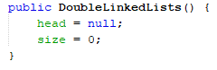
- Jawab : 
Kegunaan inisialisasi atribut head dan size seperti gambar diatas adalah untuk menunjukkan bahwa Double Linked List tersebut masih kosong.

4.	Pada method addFirst(), kenapa dalam pembuatan object dari konstruktor class Node prev dianggap sama dengan null?

- Node newNode = new Node(null, item, head);

- Jawab : 
Karena addFirst digunakan untuk menambahkan data pada Node head yang artinya node sebelum (prev) head tidak ada isinya atau bernilai null.

5.	Perhatikan pada method addFirst(). Apakah arti statement head.prev = newNode ?

- Jawab : 
Arti dari statement head.prev = newNode adalah nilai/data yang ditambahkan pada node sebelum head akan menjadi node baru 

6.	Perhatikan isi method addLast(), apa arti dari pembuatan object Node dengan mengisikan parameter prev dengan current, dan next dengan null?

- Node newNode = new Node(current, item, null);

- Jawab : 
Arti dari penulisan kode seperti diatas adalah untuk menunjukkan bahwa untuk menggunakan method addLast Double Linked List harus sudah terisi. Penggunaan prev current artinya menunjukkan bahwa node sebelum data input telat terisi, sehingga muncullah data baru yang ditambahkan dalam node baru. Pada next dari node baru adalah null karena tidak terisi data apapun.

### Jawaban 12.3.3
1.	Apakah maksud statement berikut pada method removeFirst()?

- head = head.next;
head.prev = null;

- Jawab : 
Maksud dari statement diatas adalah apabila telah dilakukan penghapusan data pada node head sehingga head baru akan bergeser dan head prev bernilai null

2.	Bagaimana cara mendeteksi posisi data ada pada bagian akhir pada method removeLast()?
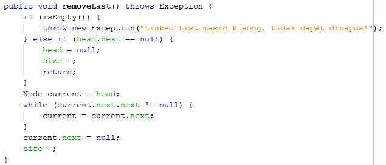
- Jawab : 
Node itu bisa saja merupakan node terakhir di daftar. Dalam situasi ini kita perbarui field _tail untuk merujuk pada node kedua dari belakang dalam daftar dan mengatur properti Next-nya menjadi null.

3.	Jelaskan alasan potongan kode program di bawah ini tidak cocok untuk perintah remove!
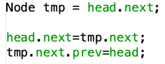
- Jawab : 
Karena pada potongan kode tersebut tidak menunjukkan bagian mana yang akan terhapus, potongan kode diatas hanya menjelaskan posisi baru yang bisa ditempati data dalam node namun berakhir pada data yang ada dalam node head

4.	Jelaskan fungsi kode program berikut ini pada fungsi remove!
 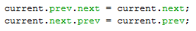
- Jawab : 
Fungsi dari kode program diatas adalah menjelaskan apabila data pada node yang dicari pada indeks tertentu

### Jawaban 12.4.3
1.	Jelaskan method size() pada class DoubleLinkedLists!

- Jawab :
Method size() pada Double Linked List berfungsi untuk mengembalikan/menghitung size yang telah digunakan dalam penambahan ataupun penghapusan data dalam operasi 

2.	Jelaskan cara mengatur indeks pada double linked lists supaya dapat dimulai dari indeks ke-
1!

- Jawab : 
Untuk mengatur indeks pada double linked list mulai dari indeks 1 maka untuk inisialisasi size dimulai pada indeks 1 bukan pada indeks 0

3.	Jelaskan perbedaan karakteristik fungsi Add pada Double Linked Lists dan Single Linked Lists!

- Jawab : 
Perbedaan karakteristiknya adalah pada single linked list tidak terdapat method add yang sama seperti pada double linked list, namun menurut saya fungsi method add pada double linked list ini sama seperti method insertAt pada single linked list. Namun memang perbedaan paling dasarnya terletak pada atribut dari masing masing yang pada double linked list terdapat prev untuk mengecek node sebelumnya.

4.	Jelaskan perbedaan logika dari kedua kode program di bawah ini!
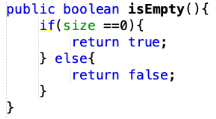 
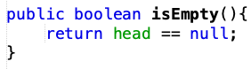
- Jawab : 
Pada logika kode program pertama untuk mengetahui linked list kosong atau terisi dilihat dari sizenya sedangkan untuk logika kode program kedua linked list bernilai null atau masih kosong otomatis node head bernilai null.

# OUTPUT PROGRAM
1. Buatlah sebuah program menggunakan double linked lists dengan pilihan menu sesuai dengan ilustrasi di bawah ini! Fitur pencarian harus menggunakan sequential search dan fitur pengurutan secara Descending mengimplementasikan (silakan pilih satu): bubble sort, selection sort, insertion sort atau merge sort.
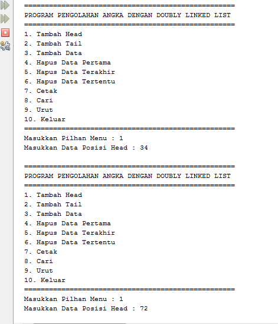
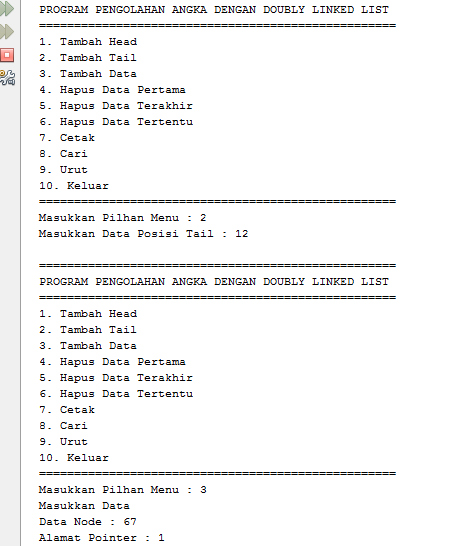
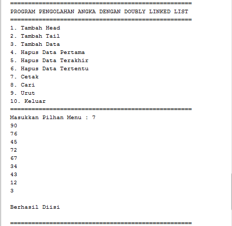
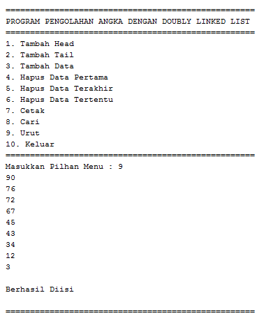
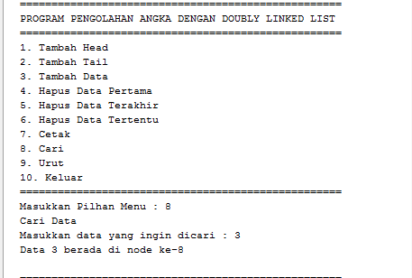
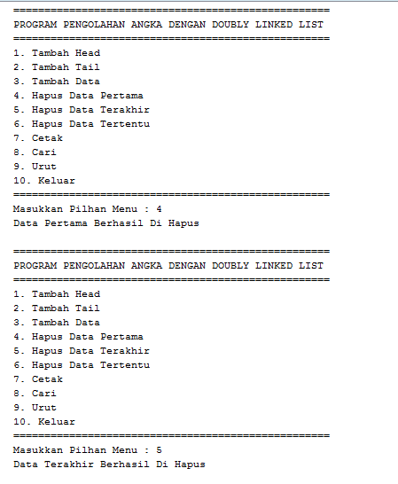
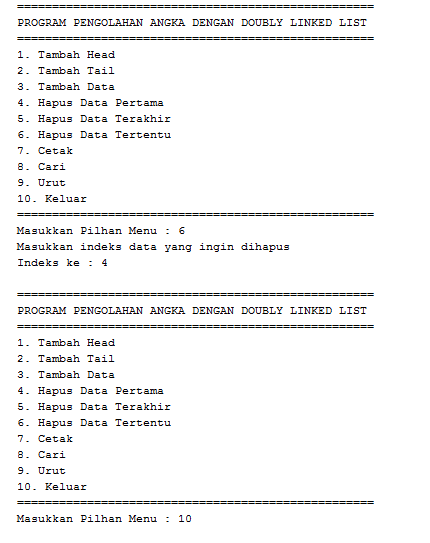

2. Implementasikan stack menggunakan double linked list dengan contoh kasus tumpukan buku
perpustakaan sesuai dengan fitur-fitur yang ditunjukkan pada gambar di bawah ini!
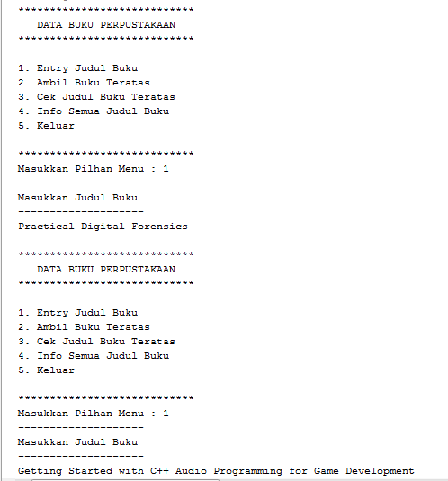
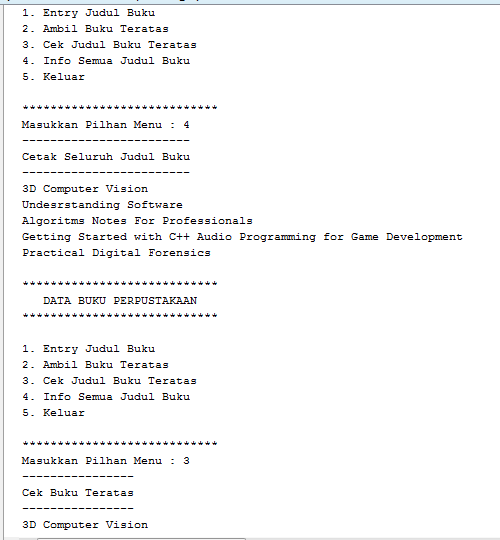
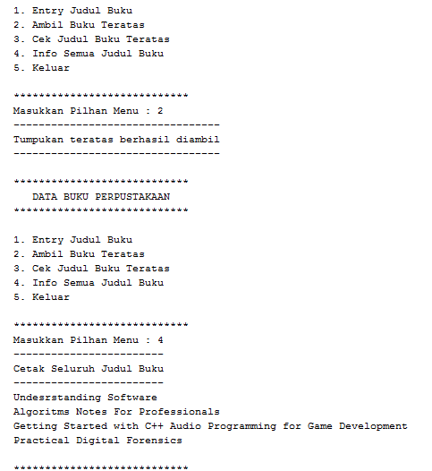

3. Buat program antrian vaksinasi menggunakan queue berbasis double linked list sesuai ilustrasi dan menu di bawah ini! (counter jumlah antrian tersisa di menu cetak(3) dan data orang yang telah divaksinasi di menu Hapus Data(2) harus ada)
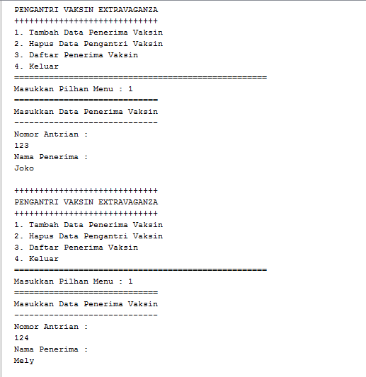
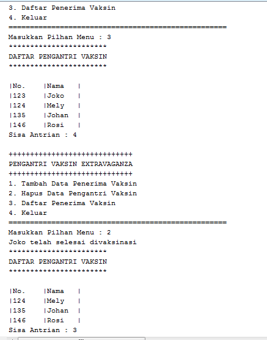

4. Buatlah implementasi program daftar nilai mahasiswa yang terdiri dari nim, nama dan ipk menggunakan double linked lists,bentuk program memiliki fitur seperti halnya nomor 1 dengan fitur pencarian melalui NIM dan pengurutan IPK secara descending.Class Mahasiswa wajib diimplementasikan dalam soal ini.
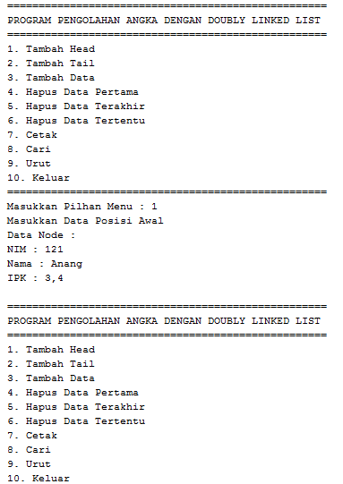
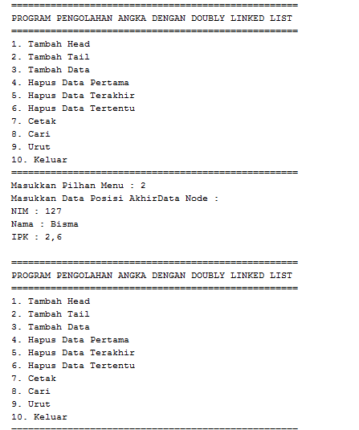
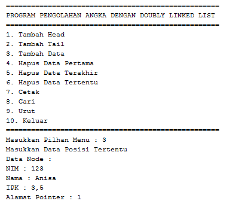
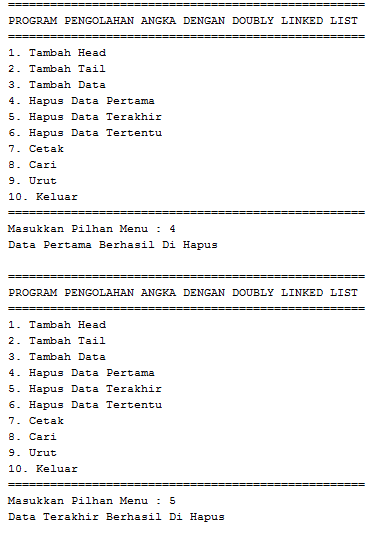
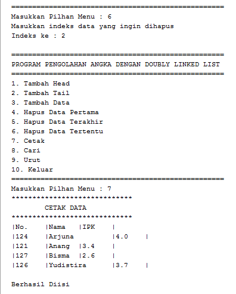
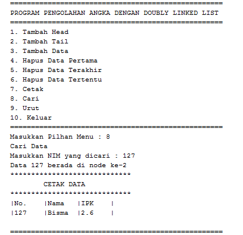
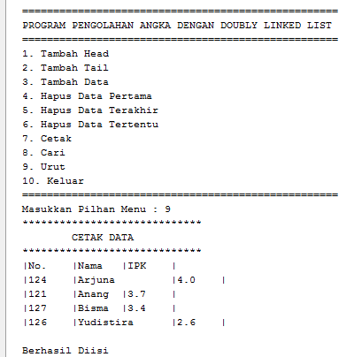

