# Laporan Praktikum Tree
## Jawaban soal
### Soal 13.2.2
1.	Mengapa dalam binary search tree proses pencarian data bisa lebih efektif dilakukan dibanding binary tree biasa?
2.	Untuk apakah di class Node, kegunaan dari atribut left dan right?
3.	a. Untuk apakah kegunaan dari atribut root di dalam class BinaryTree? 
b. Ketika objek tree pertama kali dibuat, apakah nilai dari root?
4.	Ketika tree masih kosong, dan akan ditambahkan sebuah node baru, proses apa yang akan terjadi?
5.	Perhatikan method add(), di dalamnya terdapat baris program seperti di bawah ini. Jelaskan secara detil untuk apa baris program tersebut?
- if(data<current.data){ 
    - if(current.left!=null){
        - current = current.left;
    - }else{
        - current.left = new Node(data);
        - break;
        - }
    - }

### Jawaban 13.2.2
1.	Karena dalam binary search tree merupakan tree yang tersusun terurut dengan data yang yang lebih kecil akan menempati posisi di sebelah kiri node x begitupun sebaliknya sehingga akan memudahkan dalam pencarian data, sedangkan dalam binary tree yang biasa akan menyulitkan pencarian karena data tree tersusun secara acak.
2.	Atribut left dan right pada class node berfungsi sebagai penentu letak dari child karena setiap node maksimal memiliki 2 child (left dan right)
3.	a. Kegunaan root dalam class binary tree untuk menentukan node paling atas yang pertama kali ditambahkan dan tidak punya predesesor
b. Nilai dari root adalah sama dengan nilai dari data yang ditambahkan pertama kali, apabila tree masih kosong maka nilai root juga masih kosong
4.	Ketika tree masih kosong, dan akan ditambahkan sebuah node baru, proses yang akan dilakukan adalah root = new Node (data)
5.	Pada baris program (if(data<current.data){ ) tree tersebut terisi satu node yakni root yang kemudian diberi kondisi apakah nilai data yang di masukkan setelah data root lebih kecil, jika ya maka akan melewati kondisi lagi jika pada posisi sebelah kiri sudah terisi data maka data baru yang ditambahkan akan menempati posisi sebelah kiri dibawahnya, namun jika posisi sebelah kiri masih kosong maka data baru akan menempati posisi kiri tersebut.

### Soal 13.3.2
1.	Apakah kegunaan dari atribut data dan idxLast yang ada di class BinaryTreeArray?
2.	Apakah kegunaan dari method populateData()?
3.	Apakah kegunaan dari method traverseInOrder()?
4.	Jika suatu node binary tree disimpan dalam array indeks 2, maka di indeks berapakah posisi left child dan rigth child masing-masing?
5.	Apa kegunaan statement int idxLast = 6 pada praktikum 2 percobaan nomor
4?

### Jawaban 13.3.2
1.	Kegunaan idxLast adalah untuk menentukkan batas paling akhir dari suatu indeks yang terisi
2.	Method populateData() digunakan untuk menyimpan nilai-nilai dari data yang diisikan dalam binary array tree
3.	Method traverseInOrder() digunakan untuk menampilkan/mencetak data yang dimulai dari asumsi root mulai dari indeks 0
4.	Suatu node binary tree disimpan dalam array indeks 2, maka posisi left child akan menempati indeks ke 5 (2*2+1) dan posisi right child akan menempati indeks ke 6 (2*2+2)
5.	Kegunaan statement int idxLast = 6 adalah untuk mendeklarasikan batas indeks yang dapat dicetak hanya sampai indeks ke 6

## 13.4 Tugas Praktikum
1. Buat method di dalam class BinaryTree yang akan menambahkan node dengan cara rekursif.
- Output
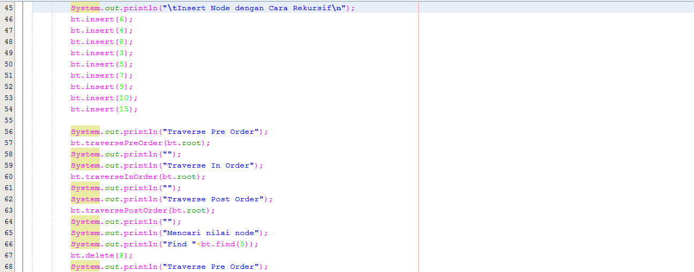
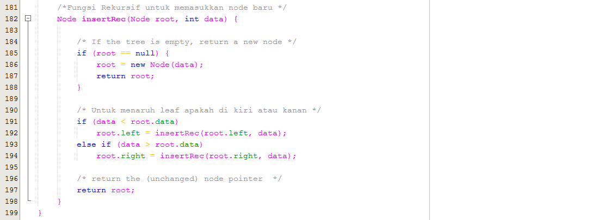
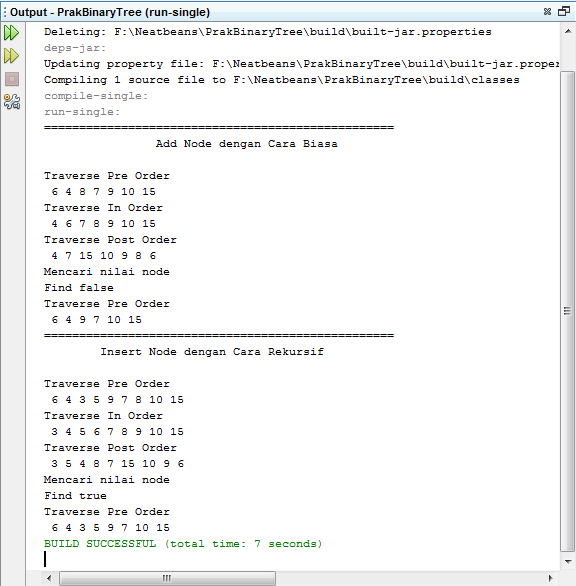

2. Buat method di dalam class BinaryTree untuk menampilkan nilai paling kecil dan yang paling besar yang ada di dalam tree.
- Output
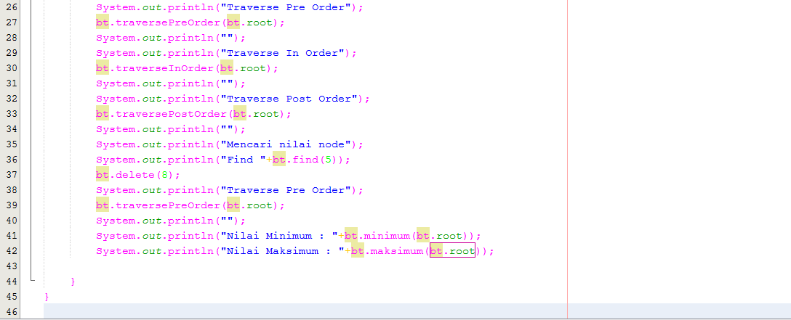
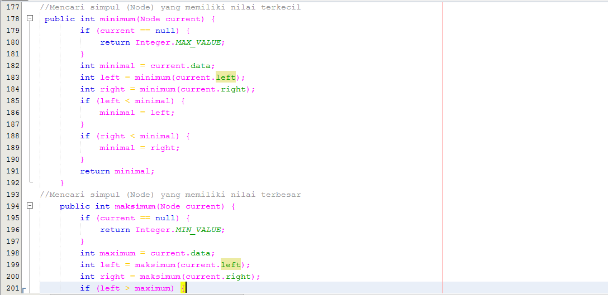
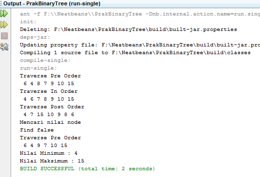

3. Buat method di dalam class BinaryTree untuk menampilkan data yang ada di leaf.
- Output
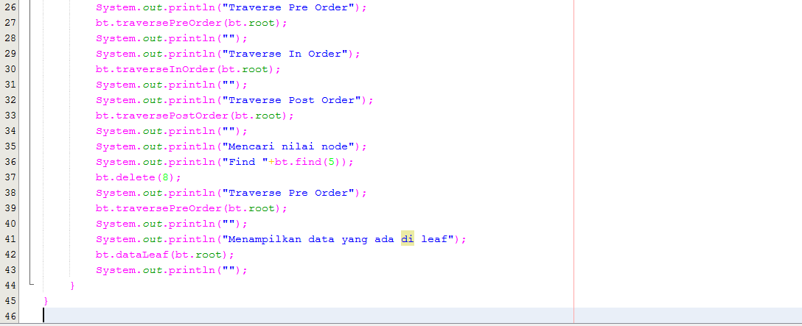
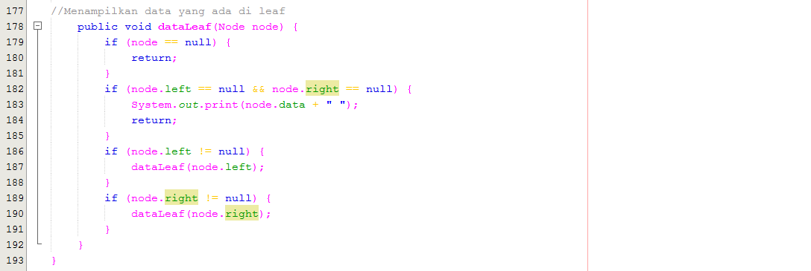
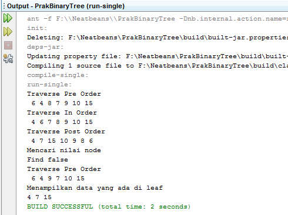

4. Buat method di dalam class BinaryTree untuk menampilkan berapa jumlah leaf yang ada di dalam tree.
- Output
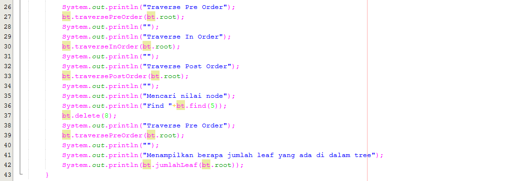
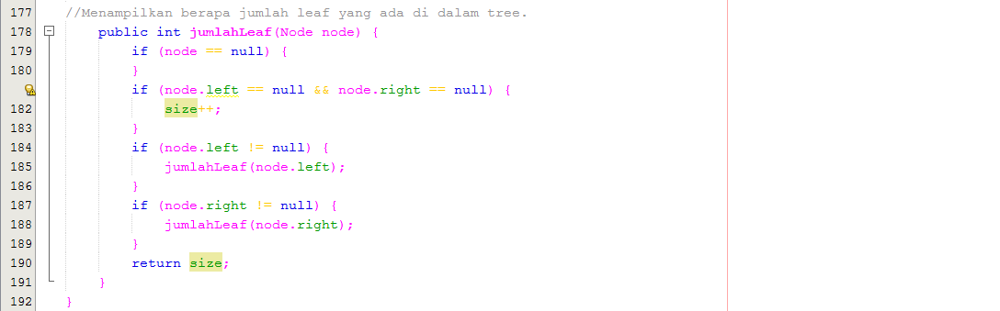
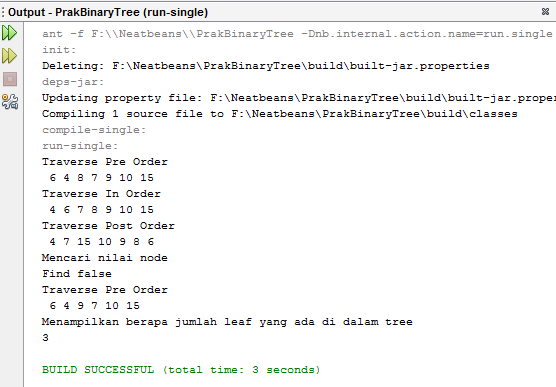

5. Modifikasi class BinaryTreeArray, dan tambahkan :

• method add(int data) untuk memasukan data ke dalam tree
- Output
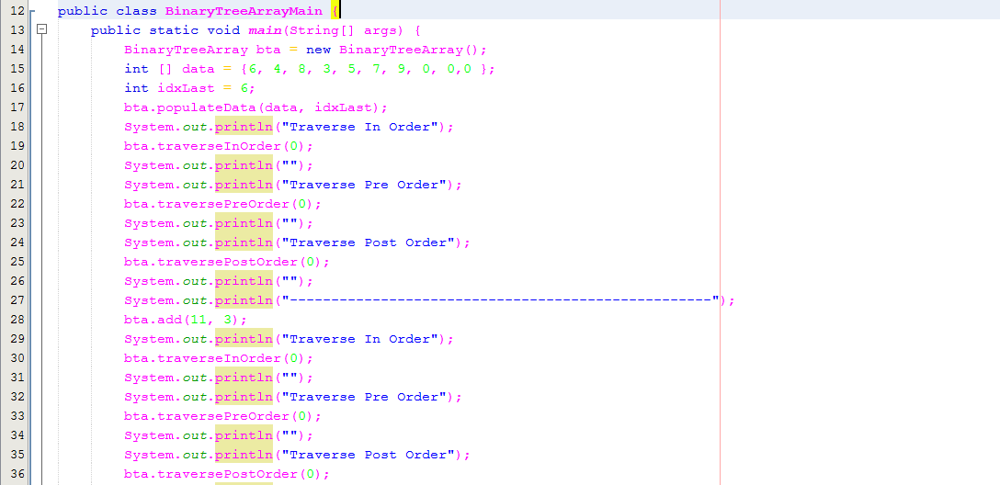
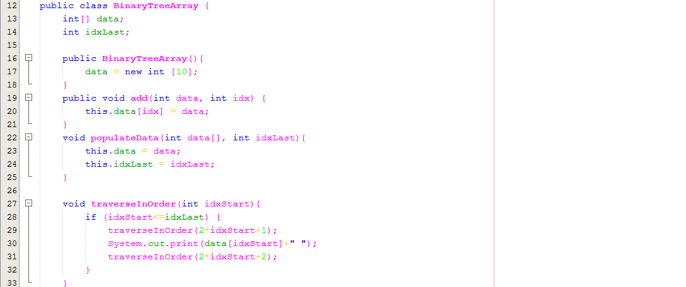

• method traversePreOrder() dan traversePostOrder()
- Output
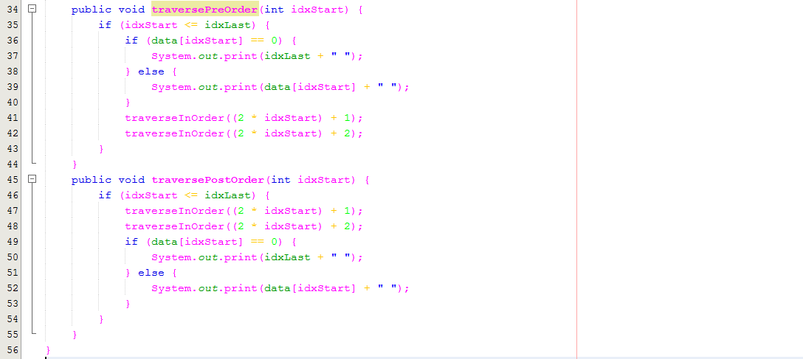
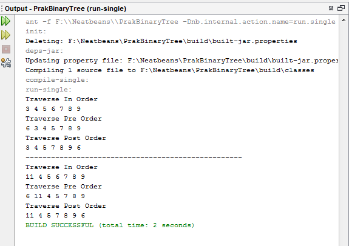