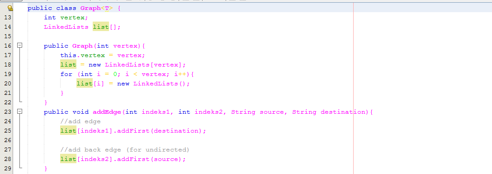

# Laporan Praktikum Graph

## Jawaban Soal

### Soal 12.2.3

1.	Sebutkan beberapa jenis (minimal 3) algoritma yang menggunakan dasar Graph, dan apakah
kegunaan algoritma-algoritma tersebut?

2.	Pada class Graph terdapat array bertipe LinkedList, yaitu LinkedList list[]. Apakah tujuan pembuatan variabel tersebut ?

3.	Apakah alasan pemanggilan method addFirst() untuk menambahkan data, bukan method add jenis lain pada linked list ketika digunakan pada method addEdge pada class Graph?

4.	Bagaimana cara mendeteksi prev pointer pada saat akan melakukan penghapusan suatu edge pada graph ?

5.	Kenapa pada praktikum 12.2 langkah ke-12 untuk menghapus path yang bukan merupakan lintasan pertama kali menghasilkan output yang salah ? Bagaimana solusinya ?

### Jawaban

1.	Jenis-jenis algoritma yang menggunakan dasar graph
- -	Algoritma Dijkstra adalah sebuah greedy algorithm dalam memecahkan permasalahan jarak terpendek (shortest path problem) untuk sebuah simple graph takberarah (undirected graph) dengan bobot-bobot sisi (edge weights) yang bernilai tak-negatif. Algoritma Djikstra bekerja dengan cara mengunjungi simpul-simpul pada graf dimulai dengan simpul sumber. Kemudian secara berulang memilih simpul-simpul terdekat dan menghitung total bobot semua sisi yang dilewati untuk mencapai simpul tersebut. ·
- -	Algoritma Bellman-Ford adalah salah satu algoritma dalam penyelesaian shortest path problem untuk weighted-directed graph (graf berarah) dimana jika ada salah satu edge-nya yang bernilai negatif. Jika dalam graf tersebut terdapat suatu cycle, dari edge negatif maka algoritma Bellman-Ford hanya bisa mendeteksinya, dan algoritma ini tidak dapat menemukan shortest path yang tidak mengulangi beberapa vertex dari graf semacam itu.
- -	Algoritma Floyd merupakan algoritma untuk pencarian lintasan terpendek pada suatu graf berbobot (weighted graph). Algoritma Floyd-Warshall membandingkan semua kemungkinan lintasan pada graf untuk setiap sisi dari semua simpul. 
- -	Algoritma Johnson adalah algoritma yang digunakan untuk mencari jarak terdekat, dimana di dalamnya juga terdapat algoritma Bellman Ford dan algoritma Dijkstra dalam menentukan nilai-nilainya. Hasil dari perhitungan ini berupa matriks. Dari matriks ini dapat diketahui panjang lintasan terpendek dari tiap titik ke semua titik lain.

2.	Pembuatan variabel tersebut digunakan untuk menyimpan data yang ada pada graph berparameter dengan jumlah vertex sama dengan jumlah length array list yang ditentukan 

3.	Menggunakan method addFirst() untuk menambahkan data karena pada method addEdge() karena data yang ditambahkan akan berada didepannya

4.	Cara mendeteksi prev pointer dengan melihat perubahan edge sebelumnya

5.	Karena pada saat penghapusan path tidak memilki kejelasan sehingga terjadi kesalahan. Solusi untuk menangani hal tersebut terdapat pada jawaban tugas nomor 3

### Soal 12.3.3

1.	Apakah perbedaan degree/derajat pada directed dan undirected graph?

2.	Pada implementasi graph menggunakan adjacency matriks. Kenapa jumlah vertices harus ditambahkan dengan 1 pada indeks array berikut?

3.	Apakah kegunaan method getEdge() ?

4.	Termasuk jenis graph apakah uji coba pada praktikum 12.3 ?

5.	Mengapa pada method main harus menggunakan try-catch Exception ?    

### Jawaban

1.	Degree (derajat), in-degree dan out-degree
Degree sebuah titik adalah jumlah busur yang
incident (terkait) dengan titik tersebut.
Atau jumlah garis yang terkait dengan titik
tersebut.

- • In-degree sebuah titik pada graph berarah adalah
jumlah busur yang kepalanya incident dengan titik
tersebut, atau jumlah busur yang “masuk” atau
menuju titik tersebut.

- • Out-degree sebuah titik pada graph berarah adalah
jumlah busur yang ekornya incident dengan titik
tersebut, atau jumlah busur yang “keluar” atau
berasal dari titik tersebut.

- • Dinotasikan d(v)
2.	Karena pada main nilai vertices bernilai 0 sedangkan perulangan yang di lakukan dimulai dari 1

3.	Method getEdge digunakan untuk menampilkan array yang menyimpan data dari graph

4.	Directed graph

5.	Setiap pernyataan yang dapat mengakibatkan exception harus berada didalam try, karena untuk menangani dimana munculnya kesalahan yang ingin di proses, catch digunakan untuk menagani jenis exception, kesalahan yang muncul akan dianggap sebagai objek.

## Output

## 12.4 Tugas Praktikum

1. Ubahlah lintasan menjadi inputan!

2. Tambahkan method graphType dengan tipe boolean yang akan membedakan graph termasuk directed atau undirected graph. Kemudian update seluruh method yang berelasi dengan method graphType tersebut (hanya menjalankan statement sesuai dengan jenis graph)

3. Modifikasi method removeEdge() agar tidak menghasilkan output yang salah untuk path selain path pertama kali!

4. Ubahlah tipe data vertex pada seluruh graph dari Integer menjadi tipe generic agar dapat menerima semua tipe data dasar Java! Misalnya setiap vertex yang awalnya berupa angka 0,1,2,3, dst. selanjutnya ubah menjadi suatu nama daerah seperti Malang,
Surabaya, Gresik, Bandung, dst

