# Laporan Best Collection

## Jawaban Soal

### Soal 16.2.3

1.	Perhatikan baris kode 25-36, mengapa semua jenis data bisa ditampung ke dalam sebuah Arraylist?
2.	Modifikasi baris kode 25-36 seingga data yang ditampung hanya satu jenis atau spesifik tipe
tertentu!
3.	Ubah kode pada baris kode 38 menjadi seperti ini
 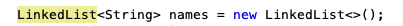
4.	Tambahkan juga baris berikut ini, untuk memberikan perbedaan dari tampilan yang sebelumnya
 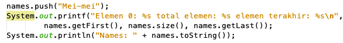
5.	Dari penambahan kode tersebut, silakan dijalankan dan apakah yang dapat Anda jelaskan!

### Jawaban 16.2.3

1.	Karena data yang ditampung tidak memiliki spesifik tipe data tertentu sehingga pada baris kode 25-36 dapat menampung semua jenis data

2.	Modifikasi kode
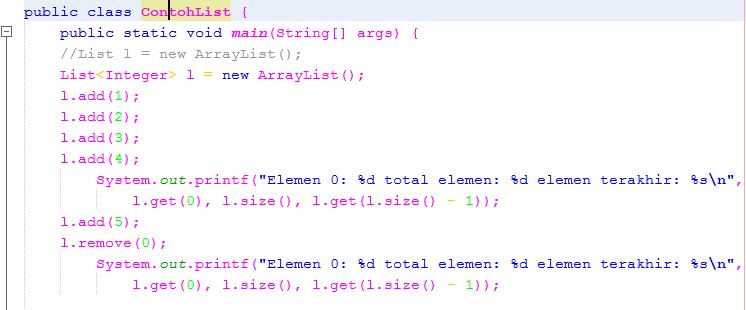

3.	Modifikasi kode
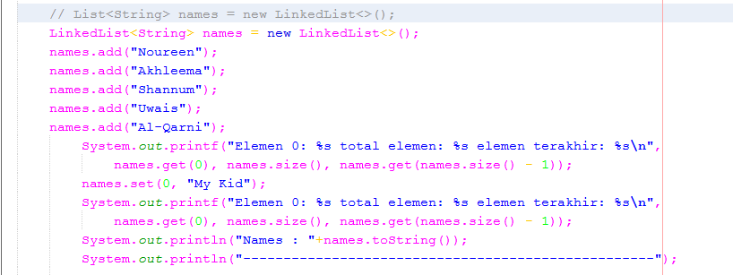

4.	Modifikasi kode
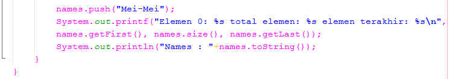

5.	Perbedaan hasil output dalam penambahan data setelah modifikasi karena sebelumnya menggunakan List saja namun telah dimodifikasi sehingga apabila dilakukan penambahan data menggunakan push maka data yang baru akan terletak pada urutan yang pertama sedangkan penambahan menggunakan add data yang di tambahkan akan bertambah dibelakangnya atau secara berurutan.
- Output hasil modifikasi
 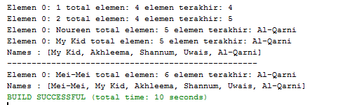

### Soal 16.3.3. 

1.	Apakah perbedaan fungsi push() dan add() pada objek fruits?
2.	Silakan hilangkan baris 43 dan 44, apakah yang akan terjadi? Mengapa bisa demikian?
3.	Jelaskan fungsi dari baris 46-49?
4.	Silakan ganti baris kode 25, Stack<String> menjadi List<String> dan apakah yang terjadi? Mengapa bisa demikian?
5.	Ganti elemen terakhir dari dari objek fruits menjadi “Strawberry”!
6.	Tambahkan 3 buah seperti “Mango”,”guava”, dan “avocado” kemudian dilakukan sorting!

### Jawaban 16.3.3

1.	Perbedaan fungsi push() dan fungsi add() adalah pada fungsi push() data akan ditambahkan pada posisi paling depan  dan akan menggantikan posisi awal sedangkan add() hanya mengikuti posisi berikutnya

2.	Maka output akan menampilkan tampilan kosong karena penambahan data tidak dilakukan (telah dihapus) 

- Modifikasi kode
 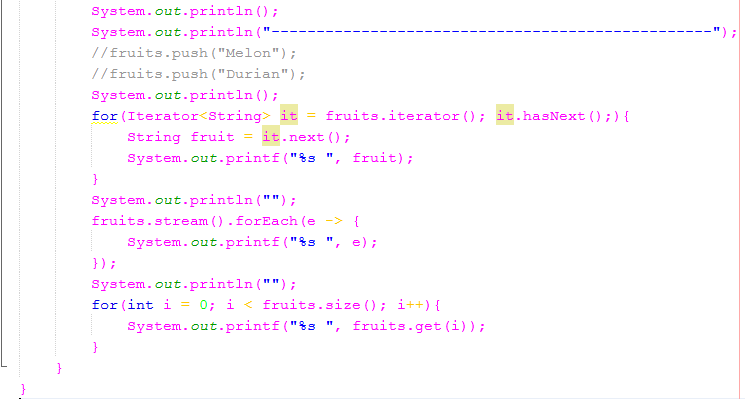
 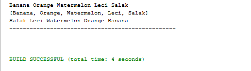
 
3.	Fungsi dari baris kode 46-49 adalah untuk mengakses dan menampilkan nilai beserta tambahan method lain yang biasanya menggunakan perulangan for each

4.	Yang terjadi setelah modifikasi adalah error pada beberapa method karena pada List tidak terdapat method yang sama dengan method pada Stack seperti push(), empty(), pop()
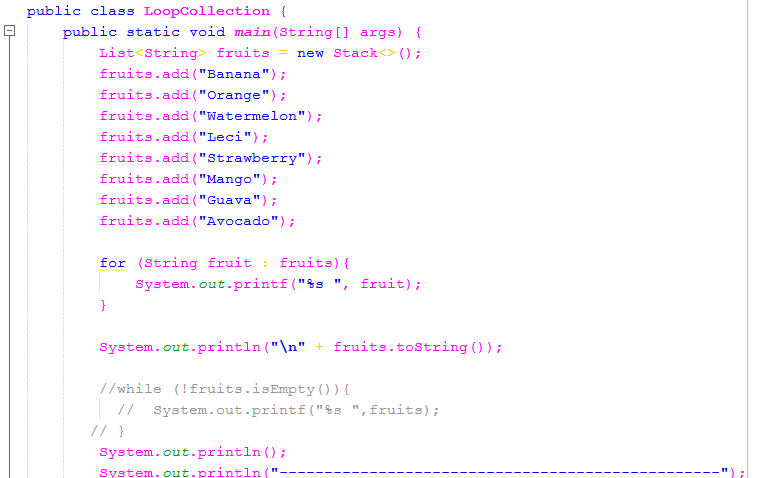

5.	Modifikasi kode
 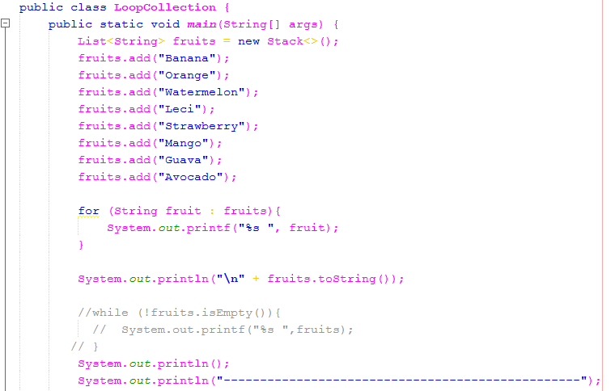

### Soal 16.4.3

1.	Pada fungsi tambah() yang menggunakan unlimited argument itu menggunakan konsep apa? Dan kelebihannya apa?
2.	Pada fungsi linearSearch() di atas, silakan diganti dengan fungsi binarySearch() dari collection!
3.	Tambahkan fungsi sorting baik secara ascending ataupun descending pada class tersebut!

### Jawaban 16.4.3

1.	Pada fungsi tambah() menggunakan konsep varargs yang memiliki kelebihan dapat mengurangi penggunaan kode karena tidak memerlukan overloaded pada method tersebut
2.	Modifikasi kode
 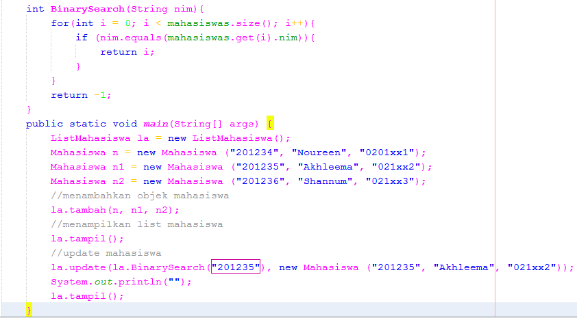
