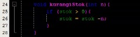
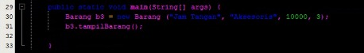
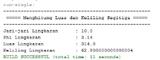
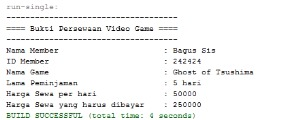
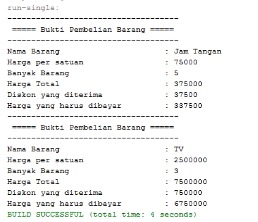

# Laporan Praktikum Objek

## Jawaban Soal 

### Jawaban 2.2.1

3.   Tidak bisa, karena tidak mempunyai class main

### Jawaban 2.2.3

1.	Setiap object memiliki 2 karakteristik yang utama yaitu atribut (status objek) dan behavior (tingkah laku dar objek)
2.	Kata kunci yang digunakan untuk mendeklarasikan class pada yaitu dengan “Class” diikuti nama classnya
3.	Pada class Barang terdapat 4 atribut antara lain namaBarang, jenisBarang, stok, hargaSatuan yang dideklarasikan pada baris 13 dan 14
4.	Pada class Barang terdapat 4 method yaitu tampilBarang(), tambahStok(), kurangiStok(), hitungHargaTotal() yang dideklarasikan pada baris 16, 23, 27, 31
5.	Modifikasi kurangiStok() agar pengurangan hanya dilakukan apabila stok lebih dari 0

 

6.	Karena untuk menambah stok berarti barang yang ditambahkan adalah barang yang utuh (bilangan bulat) sehingga berparameter satu saja
7.	Karena didalam method hitungHargaTotal() terdapat operasi hitung yang melibatkan hargaSatuan yang bertipe int sehingga agar tidak terjadi error maka method juga harus bertipe int
8.	Karena pertambahan dan pengurangan stok dapat berubah sesuai yang diisikan di class mainnya sehingga bertipe data void yang artinya akan menampilkan stok akhir tanpa mereturn setiap perubahan stok yang ada

### Jawaban 2.3.3

1.	Proses instansiasi pada baris ke 15 yang menghasilkan nama objek bl.
2.	Cara mengakses method atau atribut pada suatu objek yaitu dengan namaObjek.namaMethod() atau namaObjek.namaAtribut 

### Jawaban 2.4.3

1.	Pada class Barang deklarasi konstruktor berparameter terdapat pada baris ke 18
2.	Pada class BarangMain yang dilakukan pada baris ke 25 adalah melakukan instansiasi konstruktor berparameter 
3.	Membuat objek dengan nama b3 dengan menggunakan konstruktor berparameter dari class Barang

## OUTPUT PROGRAM

1. Output Lingkaran

2. Output Sewa

3. Output Barang

