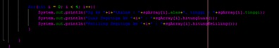

 # Laporan Praktikum Array of Objects

## Jawaban Soal

### Jawaban 3.2.3
1.  Tidak, karena atribut berfungsi untuk menyimpan nilai yang akan di tampilkan di class main, sedangkan method hanya berlaku jika memang dibutuhkan seperti menghitung sesuatu sehingga dalam satu class tidak diharuskan ada atribut dan method namun diharuskan ada atribut yang menyimpan nilai. 
2.  Karena untuk mengakses array of object maka diharuskan melakukan instansiasi sehingga pemanggilan konstruktor dilakukan
3.  Kode tersebut berarti deklarasi objek pada ppArray yang dapat menampung 3 objek persegi panjang
4.  Kode tersebut menjelaskan tentang apabila kita ingin memasukkan atribut pada objects didalam persegi panjang  ppArray pada indeks ke 1 maka harus membuat objects nya terlebih dahulu agar tidak terjadi error
5.  Agar program jelas antara class main dengan class PersegiPanjang 
 
### Jawaban 3.3.3
1.  Dapat 
2.  Contoh array of objects pada array 2 dimensi

 
3.  Program tersebut akan terjadi error karena pada indeks ppArray ke 5 belum dibuat objectsnya, jika ingin tidak terjadi error maka sebaiknya sebelum memasukkan atribut pada ppArray dilakukan dulu pembuatan objects
4. Modifikasi kode agar menjadi .length array input Scanner

5.  Tidak boleh, karena dengan adanya instansiasi array dengan nama yang sama namun berbeda cara memasukkan atributnya akan menyebabkan program menjadi bingung untuk memproses yang mana sehingga akan terjadi error, apabila ingin membuat cara memasukkan atribut secara default dan keyboard maka sebaiknya melakukan instansiasi dengan nama yang berbeda.

### Jawaban 3.4.3
1.  Dalam satu class hanya diperbolehkan satu konstruktor apabila class lebih dari satu konstruktor maka akan terjadi error
2.  Menambahkan konstruktor pada class Segitiga tersebut yang berisi parameter int a, int t
yang masing-masing digunakan untuk mengisikan atribut alas dan tinggi.

3. Menambahkan method hitungLuas dan hitungKeliling pada class Segitiga

    

4.  Pada fungsi main, buat array Segitiga sgArray yang berisi 4 elemen, isikan masing-masing
atributnya sebagai berikut:
sgArray ke-0 alas: 10, tinggi: 4
sgArray ke-1 alas: 20, tinggi: 10
sgArray ke-2 alas: 15, tinggi: 6
sgArray ke-3 alas: 25, tinggi: 10
 
5.  Kemudian menggunakan looping, cetak luas dan keliling dengan cara memanggil methodhitungLuas() dan hitungKeliling() pada class Segitiga tersebut.

 

