# Laporan Praktikum Brute Force dan Divide and Conquer

## Jawaban Soal

### Jawaban 4.2.3
1.	Jelaskan mengenai base line Algoritma Divide Conquer untuk melakukan pencarian nilai faktorial!

#### Jawab :

- Dalam base line Algoritma Divide Conquer pada class factorial menggunakan pemilihan if (n==1) return 1; yang artinya jika nilai yang akan dimasukkan nantinya adalah 1 maka hasil yang akan ditampilkan oleh program main nantinya adalah 1 dan berfungsi sebagai batas dari divide conquer dimana perulangan kali akan berakhir saat n sudah sama dengan 1.
2.	Pada implementasi Algoritma Divide and Conquer Faktorial apakah lengkap terdiri dari 3 tahapan divide, conquer, combine? Jelaskan masing-masing bagiannya pada kode program! 
#### Jawab :
- Pada percobaan 1 implementasi Algoritma Divide and Conquer sudah lengkap terdiri dari 3 tahapan dimana :
- a. Divide : membagi masalah menjadi beberapa upa-masalah yang memiliki kemiripan dengan masalah semula namun berukuran lebih kecil (idealnya berukuran hampir sama).

-  	Dalam kodingan percobaan 1 faktorial, divide ditujukan oleh adanya pemecahan masalah menjadi 2 upa masalah yang diisyaratkan dengan kondisi pemilihan if-else dimana if berperan sebagai base case dan else sebagai rekursif call.

- o	Coding :
 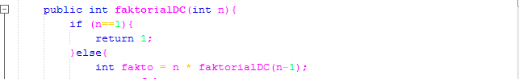
- b. Conquer: memecahkan (menyelesaikan) masing-masing upamasalah (secara rekursif)
- Dalam kodingan percobaan 1 faktorial, conquer ditujukan oleh adanya penyelesaian masalah secara reqursif dimana upa masalah diselesaikan masing-masing yang telah diisyaratkan pada codingan dalam else yang memberikan rumus int fakto = n * faktorialDC(n-1); yang berarti nanti setiap upa masalah akan dikalikan sendiri-sendiri.

- o	Coding :
 
- c. Combine: mengabungkan solusi masing-masing upa-masalah sehingga membentuk solusi masalah semula.
- Dalam kodingan percobaan 1 faktorial, combine ditujukan oleh adanya penarikan hasil keseluruhan berupa return atau pengembalian nilai dari proses rekursif pada tahap conquer yang diisyaratkan pada return fakto; di else dalam method faktorialDC()

- o	Coding :
 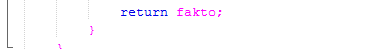

3.	Apakah memungkinkan perulangan pada method faktorialBF() dirubah selain menggunakan for?Buktikan! 

#### Jawab :

- Bisa, selama termasuk looping maka jenis looping apapun bisa digunakan pada method faktorialBF() dan saya sudah mencoba membuktikannya dengan looping jenis while dan program tetap berjalan dengan baik

- o	Coding :
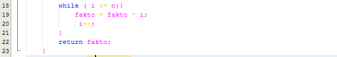
 
4.	Tambahkan pegecekan waktu eksekusi kedua jenis method tersebut!

#### Jawab : 
- a. Penambahan pengecekan waktu Awal

- b. Penambahan pengecekan waktu Akhir

- c. Penambahan pengecekan Interval Waktu (Akhir-Awal)

- o	Coding :
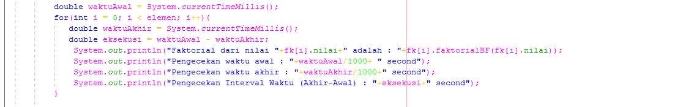
 
5.	Buktikan dengan inputan elemen yang di atas 20 angka, apakah ada perbedaan waktu eksekusi? 

#### Jawab :
- a. Elemen dibawah 20 angka
- o	Coding :
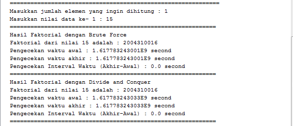
 
- b. Elemen diatas 20 angka
- o	Coding :
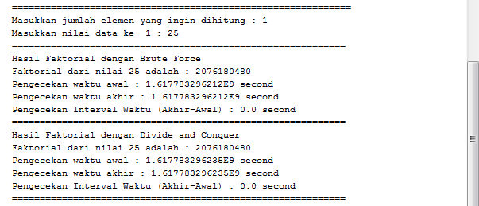
 
- c. Kesimpulan Ada perbedaan waktu eksekusi yang sangat kentara/terlihat pada program dimana pada elemen yang berjumlah kurang dari 20 angka waktu eksekusi yang diperlukan lebih sedikit daripada waktu eksekusi yang dibutuhkan oleh elemen yang berjumlah diatas 20 angka, untuk buktinya bisa anda lihat pada output program di atas

### Jawaban 4.3.3

1.	Jelaskan mengenai perbedaan 2 method yang dibuat yaitu PangkatBF() dan PangkatDC()!

#### Jawab :
- Perbedaan kedua metode tersebut yaitu PangkatBF() menggunakan metode Brute Force yang mana untuk menghitung hasil dari bilangan berpangkat dengan melakukan perulangan sebanyak pangkat yang dinginkan dengan kompleksitas 0(n),  sedangkan pada method PangkatDC menggunakan metode Divide Conquer yang mana menghitung nilai pangkat dengan membagi masalah besar menjadi lebih kecil dan mencari solusi nya dengan kompleksitas 0 (^2 log n).

2.	Pada method PangkatDC() terdapat potongan program sebagai berikut, Jelaskan arti potongan kode tersebut
 - o	Coding :
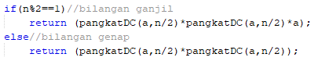
#### Jawab:
- Dalam kodingan tersebut, divide ditujukan oleh adanya pemecahan masalah menjadi 2 upa masalah yang diisyaratkan dengan kondisi pemilihan if-else dimana if berperan sebagai base case dan else sebagai rekursif call. Pada if-else yang berada di dalam else (rekursif call), if menunjukan bahwa nilai n yang diinputkan merupakan bilangan ganjil maka program yang berada didalam if akan dijalankan sedangkan jika nilai n yang dinputkan bernilai genap maka perintah yang berada didalam else yang akan di jalankan.

3.	Apakah tahap combine sudah termasuk dalam kode pada nomer 2? Tunjukkan!

#### Jawab:
- Sudah, karena pada kode tersebut terdapat return (pangkatDC(a, n/2)*pangkatDC(a, n/2)*a); dan return (pangkatDC(a, n/2)*pangkatDC(a, n/2)); yang artinya proses combine telah ditujukan oleh adanya penarikan hasil keseluruhan berupa return atau pengembalian nilai dari proses rekursif pada tahap conquer
- o	Coding :

4.	Modifikasi kode program tersebut, anggap proses pengisian atribut dilakukan dengan
konstruktor.
- o	Coding :
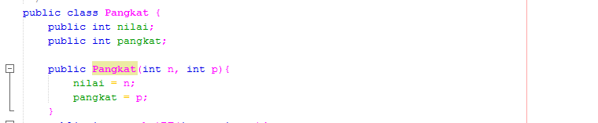
- o	Coding :
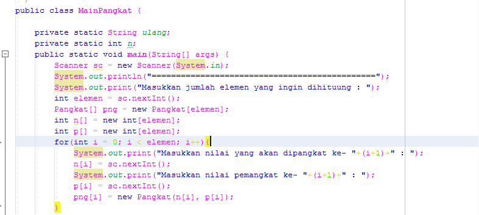
 
5.	Tambahkan menu agar salah satu method yang terpilih saja yang akan dijalankan!

#### Jawab:
- a.	Kode program
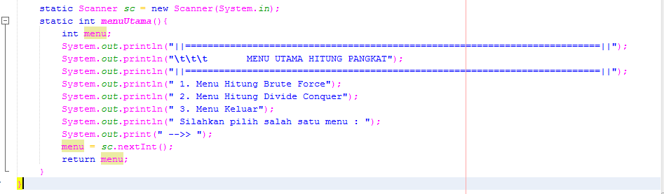

- b.	Output program
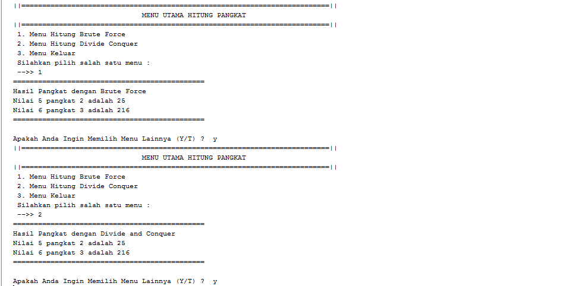
 

### Jawaban 4.4.3
1.	Berikan ilustrasi perbedaan perhitungan keuntungan dengan method TotalBF() ataupun
TotalDC()

#### Jawab:
- Pada method TotalBF() perhitungan dilakukan secara langsung sebanyak nilai yang diinput para array sedangkan TotalDC() masih perlu dibagi lagi baru perjumlahan dilakukan

2.	Perhatikan output dari kedua jenis algoritma tersebut bisa jadi memiliki hasil berbeda di
belakang koma. Bagaimana membatasi output di belakang koma agar menjadi standar untuk
kedua jenis algoritma tersebut.

#### Jawab:
- Cara membatasi nilai dibelakang koma antara kedua algoritma tersebut dengan menggunakan tipe data yang sama pada penulisan source code pada method masing masing

- Output program
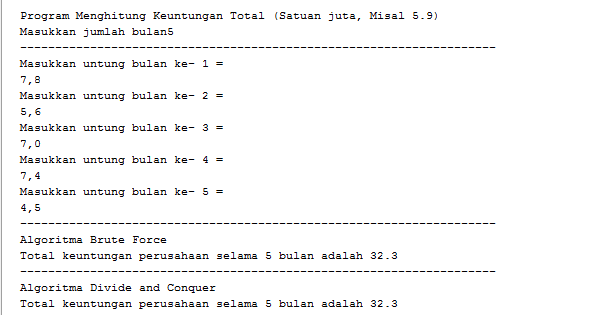
 
3.	Mengapa terdapat formulasi return value berikut?Jelaskan!

#### Jawab:
- Formulasi return digunakan untuk menjumlah keuntungan dari n bulan sehingga hasilnya kan dihitung melalui formulasi return value tersebut, apabila tidak terdapat formulasi tersebut maka hasil dari penjumlahan keuntungan pada Divide Conquer tidak akan ada nilainya.
- o	Coding :
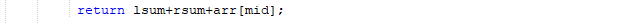

4.	Kenapa dibutuhkan variable mid pada method TotalDC()?

#### Jawab:
- Karena variabel mid pada method TotalDC() menunjukan banyaknya elemen/jumlah bulan untuk menghitung banyaknya keuntungan.

5.	Program perhitungan keuntungan suatu perusahaan ini hanya untuk satu perusahaan saja.
Bagaimana cara menghitung sekaligus keuntungan beberapa bulan untuk beberapa
perusahaan.(Setiap perusahaan bisa saja memiliki jumlah bulan berbeda-beda)? Buktikan
dengan program!
- o	Coding :
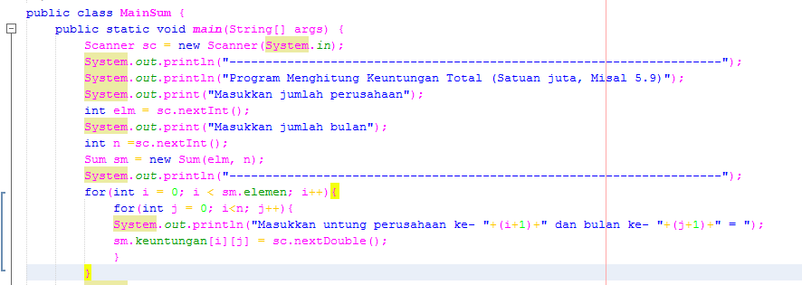
 
## OUTPUT PROGRAM
1. Nilai Algoritma 1
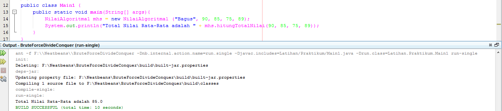

2. Nilai Algoritma 2
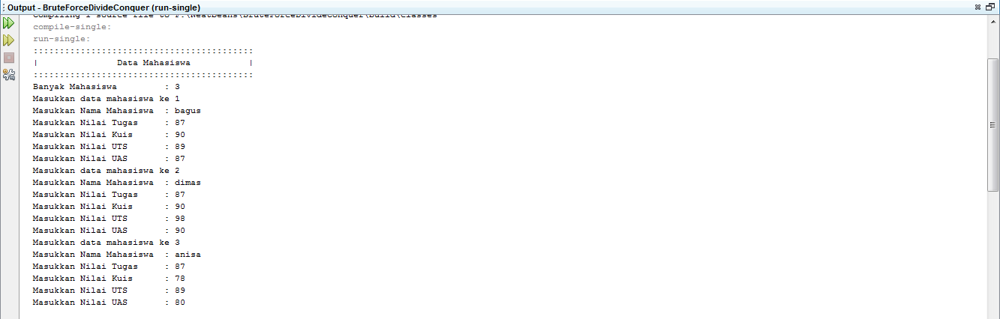
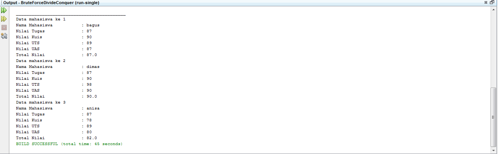

3. Nilai Algoritma 3
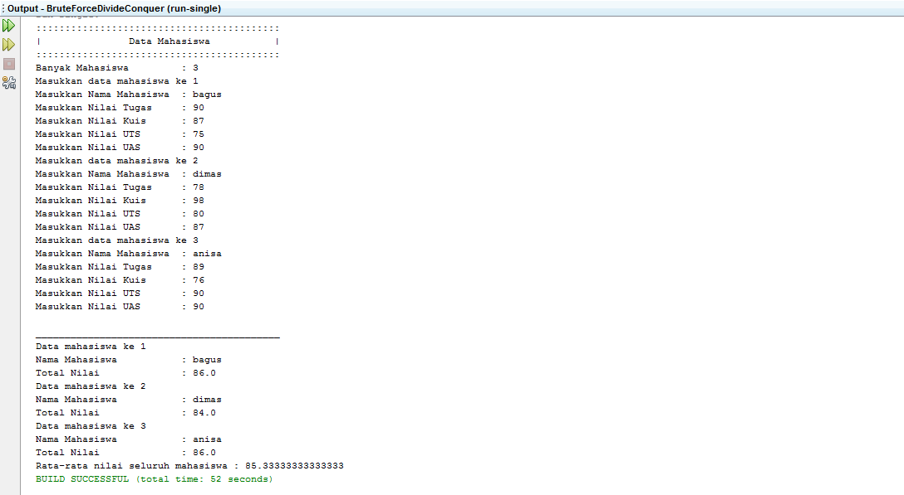

4. Perhitungan Suara
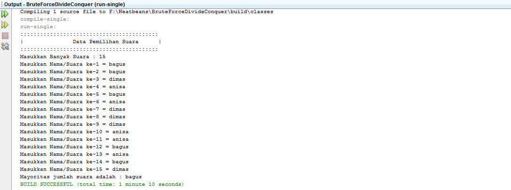