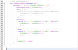
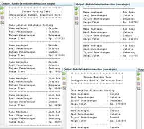
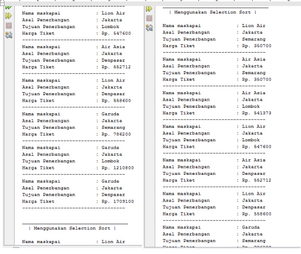
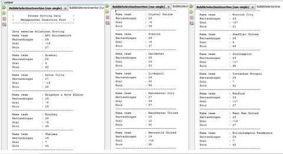
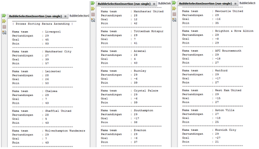

# Laporan Bubble-Selection-Insertion Sort

## Jawaban Soal

### Jawaban 5.2.3
1.	Proses bubble sort terdapat di method bubbleSort() pada baris 26 
2.	Pada program tersebut tidak terdapat method proses selection sort
3.	Swap adalah proses pertukaran posisi nilai elemen data agar terurut sesuai sorting yang dilakukan.
Contoh potongan program proses swap:
Mahasiswa tmp = listMhs[j];
            listMhs[j] = listMhs[j-1];
        listMhs[j-1] = tmp; 
4.	Proses pada method bubbleSort() digunakan untuk melakukan pertukan posisi/swapping yang bertujuan agar nilai elemen data terurut secara descending
5.	a. Perbedaan antara kegunaan perulangan i dan perulangan j adalah  terdapat pada nilai indeks i dan j, indeks 1 dimulai dari 0 sedangkan indeks j dimulai dari 1. Perulangan yang menggunakan variabel i = 0 adalah tahapan sorting, sedangkan variabel j untuk tahapan melakukan swap
b. Karena perulangan tersebut adalah proses untuk melakukan sorting
c. Karena perulangan tersebut adalah proses untuk melakukan swap
d. Perulangan i akan berlangsung 49 kali perulangan. Sedangkan tahap bubble sort yang dilakukan 48 kali 

### Jawaban 5.3.3
1.	Proses tersebut termasuk proses mencocokkan nilai, lalu dilakukan pengurutan ipk dengan cara mencari nilai terendah didalam array kemudian menempatkannilai tersebut di paling awal, lalu di seleksi secara berurutan terus sampai nilai yang terbesar.

### Jawaban 5.4.3
1. Ubahlah fungsi pada InsertionSort sehingga fungsi ini dapat melaksanakan proses sorting
dengan cara ascending atau decending, anda dapat melakukannya dengan menambahkan
parameter pada pemanggilan fungsi insertionSort.

## Output Program
1. Output Tiket

2. Output League

