# Laporan Praktikum Searching

## Jawaban Soal

### Jawaban 6.2.3
1.	Pada method TampilData digunakan untuk menampilkan data yang dari NIM yang sedang dicari sedangkan Tampilposisi hanya menampilkan letak dimana data dari NIM yang sedang dicari itu.
2.	Fungsi break pada kode program tersebut adalah untuk menghentikan perulangan dalam percarian posisi NIM yang sedang dicari sehingga apabila NIM yang sedang dicari sudah ditemukan maka indeks pada perulangan tempat ditemukannya NIM tersebut akan menggantikan nilai dari posisi.
3.	Program masih tetap bisa berjalan dan memiliki hasil output dengan benar. Hal ini dikarenakan pada Sequential Search pengurutan data secara Ascending/Descending tidak diperlukan yang penting nilai yang dicari ada pada data tersebut entah di awal, ditengah maupun diakhir.

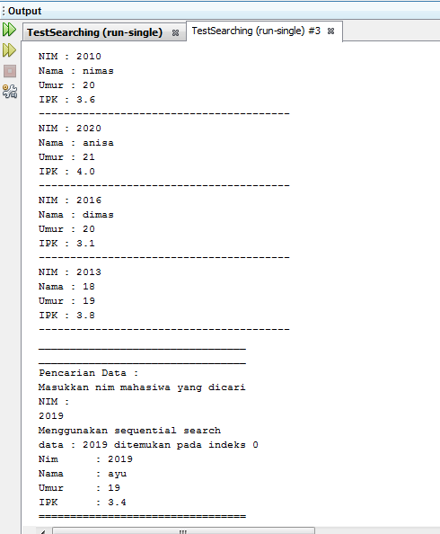
 
### Jawaban 6.3.3
1.	Kode program proses divide

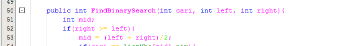
 
2.	Kode program proses conquer

 
3.	Program masih tetap bisa berjalan, namun untuk pencarian pada binary search tidak ditemukan hasil yang sama dengan sequential search, hal ini dikarenakan pada binary search data atau nilai yang dicari harus dalam keadaan terurut tidak seperti sequential search yang meskipun tidak terurut masih bisa menemukan data yang dicari, sehingga apabila ingin mencari data atau nilai dengan binary search maka pengisian data harus dilakukan secara terurut baik ascending/descending.
4.	Hasil dari binary search tidak ditemukan atau tidak sesuai

- Sebelum modifikasi program

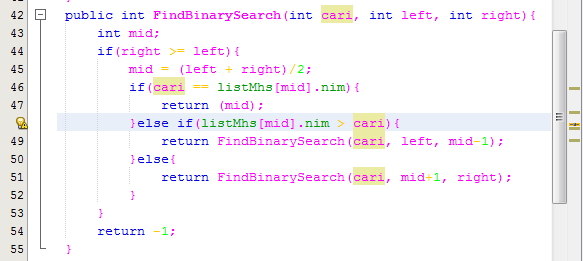

- Hasil output sebelum modifikasi program:
 
 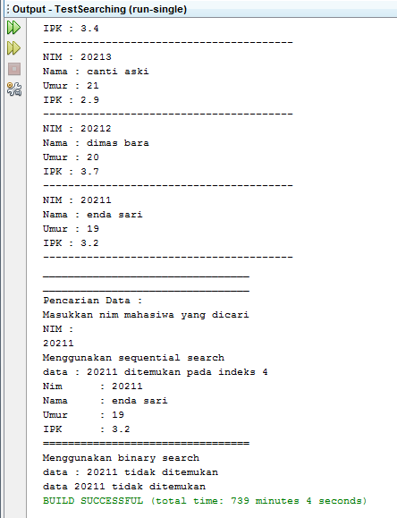

- Modifikasi program binary search

- Hasil output setelah modifikasi
 
 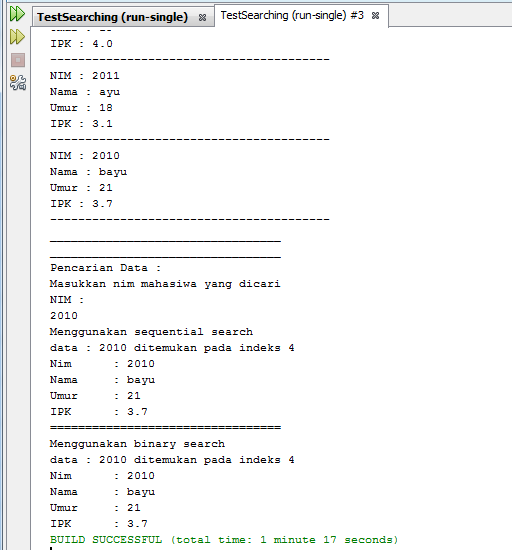

5.	Modifikasi program agar jumlah mahasiswa yang akan didata dapat ditentukan melalui input keyboard
 
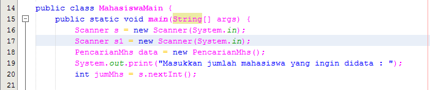

## OUTPUT PROGRAM
1.	 Modifikasi percobaan searching diatas dengan ketentuan berikut ini
- Sebelum dilakukan searching dengan binary search data harus dilakukan pengurutan dengan menggunakan algoritma sorting (pilih salah satu algoritma sorting dari pertemuan sebelumnya)

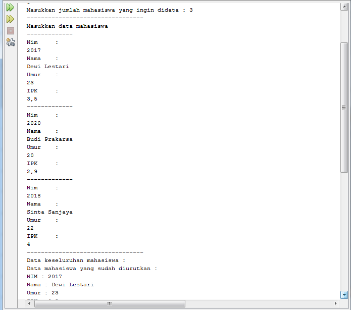
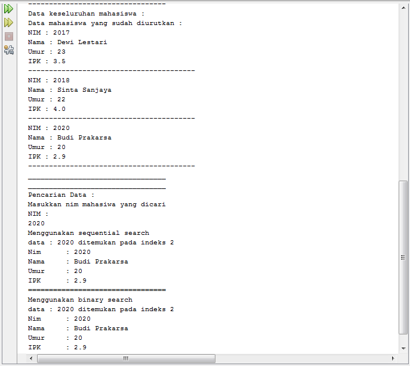

2. Modifikasi percobaan searching diatas dengan ketentuan berikut ini
- Pencarian dilakukan berdasarkan Nama Mahasiswa (gunakan Algoritma Sequential Search)
- Jika terdapat nama yang sama? Bagaimana keluaran dari kode program ketika pencarian dilakukan pada nama yang sama!

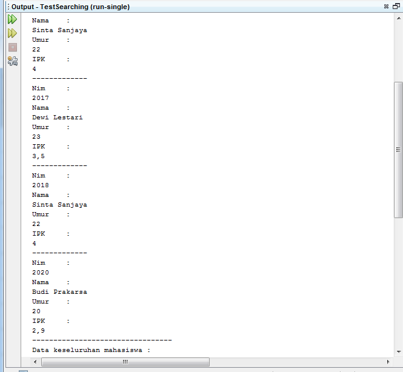
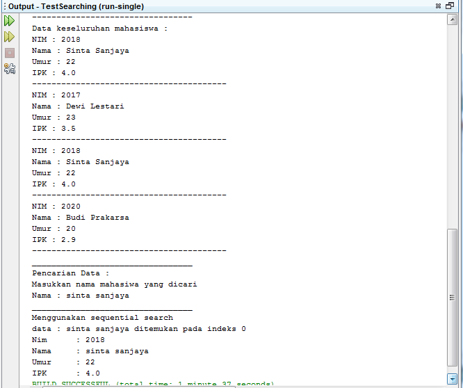

3. Berdasarkan data, buatlah program untuk melakukan pencarian data pada array dua dimensi tersebut, dimana data yang dicari di inputkan melalui keyboard (menggunakan sequential search ) !

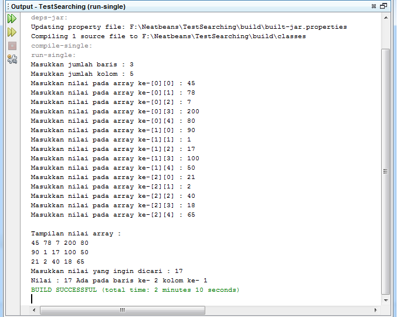

4. Buatlah program untuk mengurutkan array tersebut (boleh memilih metode pengurutan) selanjutnya lakukan pencarian dan mencetak isi array yang nilainya terbesar, dan mencetak adaberapa buah nilai terbesar tersebut serta berada dilokasi mana saja nilai terbesar tersebut(menggunakan binary search)!

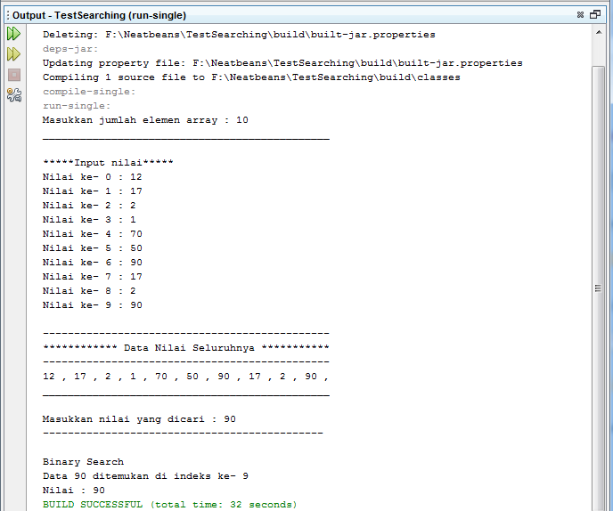