# Laporan Praktikum Stack

## Jawaban dan Soal
### Jawaban 7.2.3
 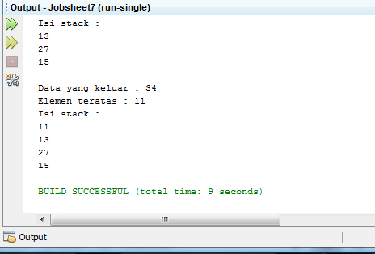
1.  Perhatikan class StackMain, apakah fungsi angka 5 pada potongan kode program berikut?

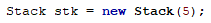

- Jawab:
Angka 5 pada potongan kode program tersebut berfungsi sebagai batas kapasitas penyimpanan pada stack yang dapat diisi data.

2.   Lakukan penambahan data ke stack sebanyak dua kali, menggunakan angka 18 dan 40. Tampilkan hasilnya!
- Jawab:
 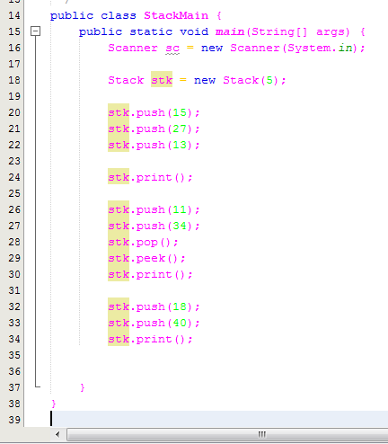
 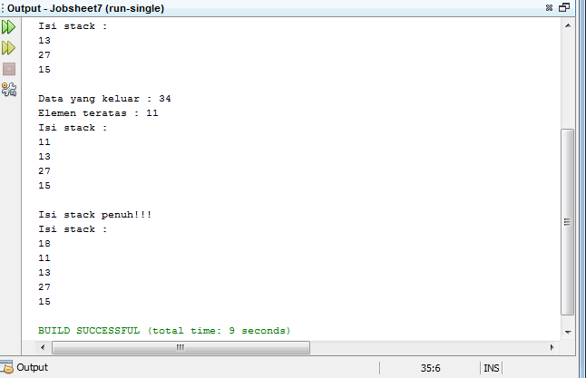
 
3.  Pada soal nomor 2, mengapa data yang dimasukkan ke dalam Stack hanya angka 18, sedangkan angka 40 tidak dimasukkan? Jelaskan!
Jawab:
Karena stack sudah terisi penuh pada angka 18 sehingga hanya angka 18 saja yang tercetak

### Jawaban 7.3.3
 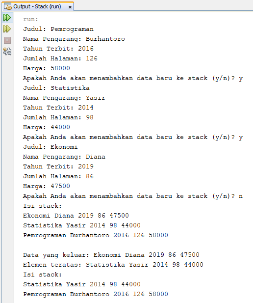

1.  Perhatikan class StackMain, pada saat memanggil fungsi push, parameter yang dikirimkan adalah bk. Data apa yang tersimpan pada variabel bk tersebut?
 
- 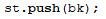

- Jawab:
Karena bk merupakan konstruktor berparameter Data yang tersimpan pada variabel bk adalah judul, nama pengarang, tahun terbit, jumlah halaman, dan harga. 
2.  Tunjukkan potongan kode program untuk menentukan kapasitas penampungan stack!
- Jawab:
 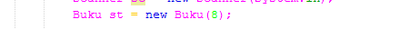
3.  Apakah fungsi penggunaan do-while yang terdapat pada class StackMain?
- Jawab:
Fungsi penggunaan do-while pada class StackMain adalah untuk melakukan perulangan pengisian data pada saat dilakukan penambahan data baru pada stack
4.  Modifikasi kode program pada class StackMain sehingga pengguna dapat memilih operasi operasi pada stack (push, pop, peek, atau print) melalui pilihan menu program!
- Jawab:
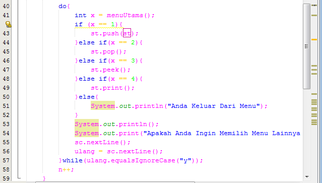
 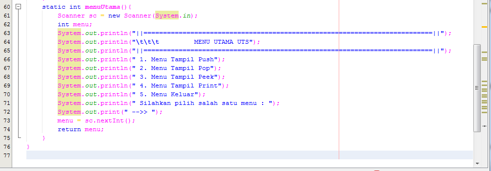
 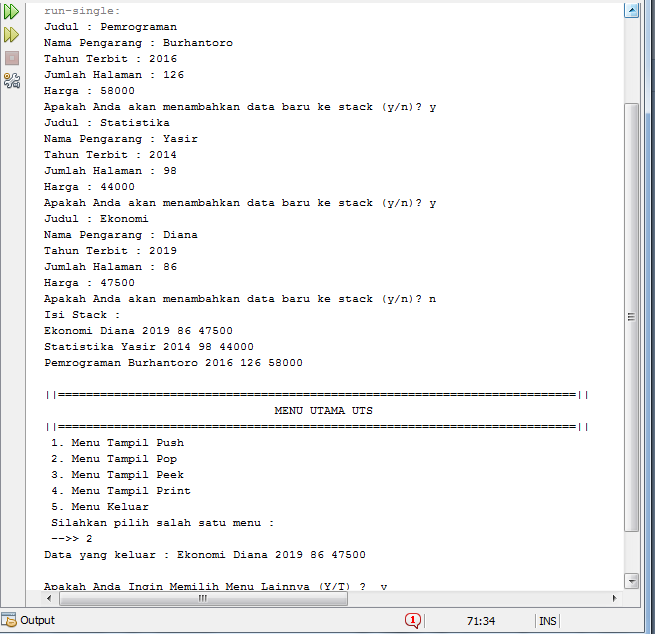
 
### Jawaban 7.4.3
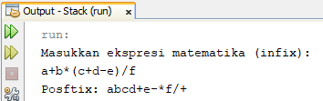

1.  Perhatikan class Postfix, jelaskan alur kerja method derajat!
- Jawab:
Alur kerja method derajat adalah menjelaskan urutan pengerjaan sesuai dengan tanda dari operasi 
2.  Apa fungsi kode program berikut?

- 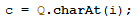

- Jawab:
Berfungsi sebagai pengembali karakter sesuai indeks yang diisikan
3.  Jalankan kembali program tersebut, masukkan ekspresi 3*5^(8-6)%3. Tampilkan hasilnya!
 - Jawab:
 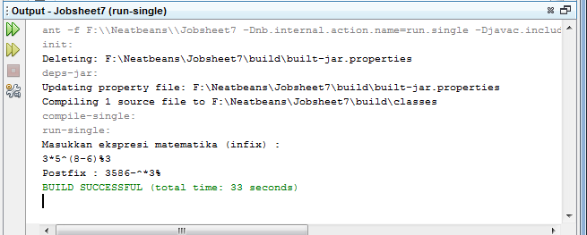
4.  Pada soal nomor 2, mengapa tanda kurung tidak ditampilkan pada hasil konversi? Jelaskan!
Jawab:
Karena tanda kurung ( digunakan untuk menyimpan simbol yang ada dalam stack sedangkan tanda kurung ) berfungsi mengeluarkan operator-operator yang ada dalam stack. Sehingga tanda kurang () tidak ditampilkan pada hasil.

